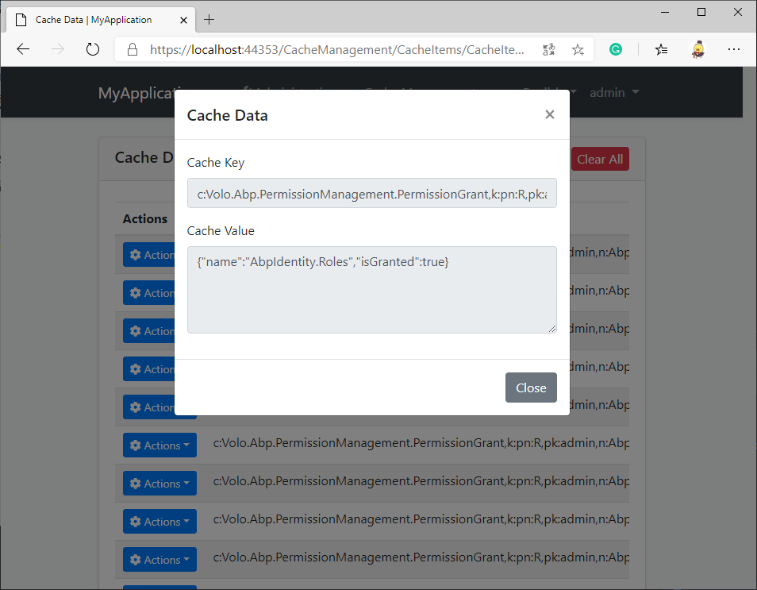

# CacheManagement
An abp application module helps administrators to manage the app cache data.

## Getting Started

* Install with [AbpHelper](https://github.com/EasyAbp/AbpHelper.GUI)

    Coming soon.

* Install Manually

    1. Install `EasyAbp.CacheManagement.Application` NuGet package to `MyProject.Application` project and add `[DependsOn(CacheManagementApplicationModule)]` attribute to the module.

    1. Install `EasyAbp.CacheManagement.Application.Contracts` NuGet package to `MyProject.Application.Contracts` project and add `[DependsOn(CacheManagementApplicationContractsModule)]` attribute to the module.

    1. Install `EasyAbp.CacheManagement.Domain` NuGet package to `MyProject.Domain` project and add `[DependsOn(CacheManagementDomainModule)]` attribute to the module.

    1. Install `EasyAbp.CacheManagement.Domain.Shared` NuGet package to `MyProject.Domain.Shared` project and add `[DependsOn(CacheManagementDomainSharedModule)]` attribute to the module.

    1. Install `EasyAbp.CacheManagement.EntityFrameworkCore` NuGet package to `MyProject.EntityFrameworkCore` project and add `[DependsOn(CacheManagementEntityFrameworkCoreModule)]` attribute to the module.

    1. Install `EasyAbp.CacheManagement.HttpApi` NuGet package to `MyProject.HttpApi` project and add `[DependsOn(CacheManagementHttpApiModule)]` attribute to the module.

    1. Install `EasyAbp.CacheManagement.HttpApi.Client` NuGet package to `MyProject.HttpApi.Client` project and add `[DependsOn(CacheManagementHttpApiClientModule)]` attribute to the module.

    1. Install `EasyAbp.CacheManagement.MongoDB` NuGet package to `MyProject.MongoDB` project and add `[DependsOn(CacheManagementMongoDbModule)]` attribute to the module.

    1. (Optional) If you need MVC UI, install `EasyAbp.CacheManagement.Web` NuGet package to `MyProject.Web` project and add `[DependsOn(CacheManagementWebModule)]` attribute to the module.
    
    1. Add `options.ConventionalControllers.Create(typeof(CacheManagementApplicationModule).Assembly);` to `Configure<AbpAspNetCoreMvcOptions>(options => { ... });` in your host module (It is usually Web project or HttpApi.Host project).
    
    1. Install `EasyAbp.CacheManagement.StackExchangeRedis` NuGet to your host module (It is usually Web project or HttpApi.Host project) and add `[DependsOn(CacheManagementStackExchangeRedisModule)]` attribute to the module. (If you are using other distributed cache provider, please [find a correct driver](https://github.com/EasyAbp/CacheManagement/tree/master/driver).)

    1. Add `builder.ConfigureCacheManagement();` to OnModelCreating method in `MyProjectMigrationsDbContext.cs`.

    1. Add EF Core migrations and update your database. See: [ABP document](https://docs.abp.io/en/abp/latest/Tutorials/Part-1?UI=MVC#add-new-migration-update-the-database).

## Usage

1. Add permissions to the roles you want.

1. Add your own cache items.

1. Enjoy this wonderful module.

## Roadmap

- [ ] Cache values modification.
- [ ] More detailed documentations.
- [ ] More drivers.
- [ ] Unit tests.
